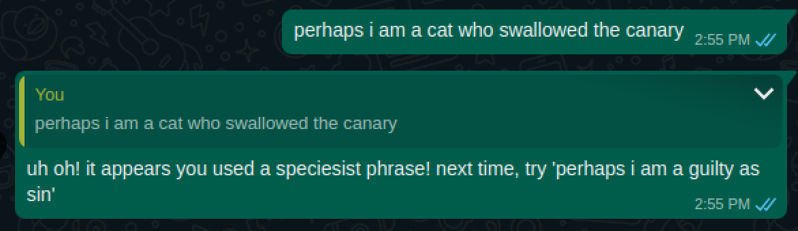
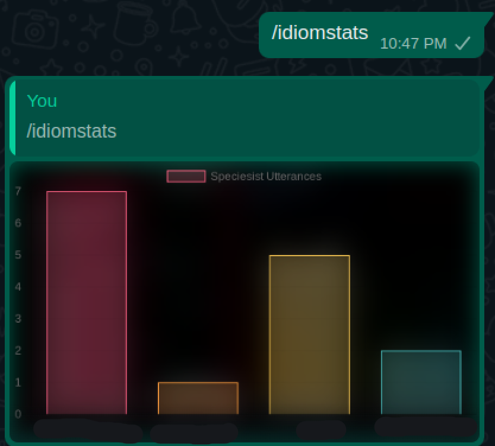

# remorahchat

Admonishes speciesist language in WhatsApp chats.

## Features

### Admonitions

If you have the gall to use [anti-animal language](https://www.peta.org/features/animal-friendly-idioms/) as defined
by PETA in a WhatsApp chat, the configured user will reply to that message with an animal-friendly alternative:



### High Scores

High scores will be tracked. Simply send a message with just the text
`/idiomstats` to retrieve this data:



## Setup

### AWS

This app deploys to AWS lambda based on your AWS CLI's default profile.

### WhatsApp API

Create an account at https://whapi.cloud/ to get an API token.

When lambda deploy completes, it will tell you the lambda's gateway endpoint. In your whapi channel, change the webhooks URL
to `gateway/webhooks` where `gateway` is the lambda gateway. Make sure only the `messages POST` button is toggled.

### Mongo 

You can get a free shared cluster on Mongo Atlas.

## Deploying

```sh
# install packages
npm i

# your whapi token
export MSG_TOKEN=XXX

# your chat id
# for regular chats you can find id using this endpoint: https://whapi.readme.io/reference/getchats
# for group chats you can find id using this endpoint: https://whapi.readme.io/reference/getgroups
export CHAT_ID=YYY

# postgres connection string
export MONGO_CONN=ZZZ

# deploy to aws lambda
serverless deploy
```
